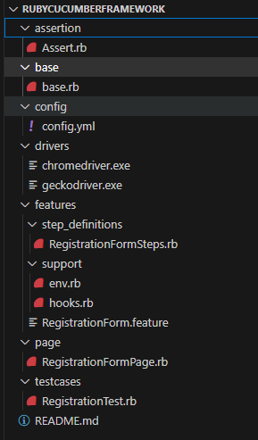

# Ruby Cucumber POM Framework
- Selenium WebDriver 4
- BDD
- POM
- Rspec
- test::unit
- Multi browsers support

## Requirements 
- ruby 3.2.2 or above
- VS Code

## Dependencies Gems
- require 'selenium-webdriver' 
- require 'yaml" 
- require 'test/unit'
- require 'rspec'
- require 'cucumber'

## Framework's structure

## test execution

1. Open CMD
2. Navigate to project folder
3. Run command: cucumber --tags @P1
